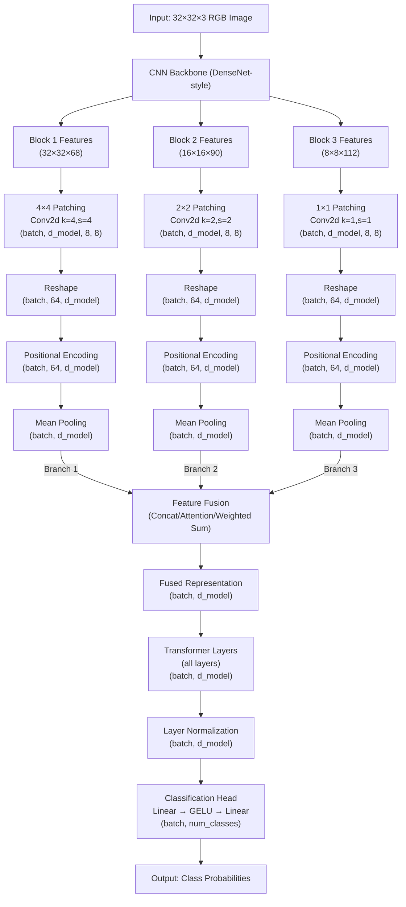

# CNNMultiPatchPixT (Mean Pooling Fusion)

This model combines a CNN backbone with multi-scale feature extraction. CNN features at different resolutions are patched to create uniform token sequences and mean-pooled before fusion.

## Detailed Architecture Flowchart



## High-Level Architecture

```css
Input: 32x32x3 RGB Image
    ↓
[CNN BACKBONE - DENSENET STYLE]
    ↓
    ├────────────────────┬────────────────────┤
    │                    │                    │                    
    ↓                    ↓                    ↓                    
[BLOCK 1 OUTPUT]    [BLOCK 2 OUTPUT]    [BLOCK 3 OUTPUT]
(32x32, C1)        (16x16, C2)         (8x8, C3)
    │                    │                    │
    ↓                    ↓                    ↓
[4×4 PATCHING]      [2×2 PATCHING]      [1×1 PATCHING]
Non-overlapping     Non-overlapping     Non-overlapping
    │                    │                    │
    ↓                    ↓                    ↓
[PATCH EMBEDDING]    [PATCH EMBEDDING]   [PATCH EMBEDDING]
(batch, 64, d_model) (batch, 64, d_model) (batch, 64, d_model)
    │                    │                    │
    ↓                    ↓                    ↓
[POSITIONAL ENC]     [POSITIONAL ENC]    [POSITIONAL ENC]
    │                    │                    │
    ↓                    ↓                    ↓
[MEAN POOLING]       [MEAN POOLING]      [MEAN POOLING]
(batch, d_model)     (batch, d_model)    (batch, d_model)
    │                    │                    │
    └────────────────────┴────────────────────┘
                         │
                         ↓
                    [FEATURE FUSION]
                  Concat/Attention/Weighted Sum
                         │
                         ↓
                 [TRANSFORMER LAYERS]
                    (all layers)
                         │
                         ↓
                 [CLASSIFICATION HEAD]
                  Linear → GELU → Linear
                         │
                         ↓
                  Output: Class Probabilities
```

## Architecture Details

### CNN Backbone
- **DenseNet-style** architecture with 3 blocks
- Each block contains dense connections for better feature propagation
- Features are extracted at 3 scales: 32x32, 16x16, and 8x8

### Uniform Patching
- **Branch 1**: 4×4 patches from 32×32 feature map → 8×8 grid → 64 tokens
- **Branch 2**: 2×2 patches from 16×16 feature map → 8×8 grid → 64 tokens
- **Branch 3**: 1×1 patches from 8×8 feature map → 8×8 grid → 64 tokens
- Each branch has **exactly the same number of tokens** (64)

### Mean Pooling Features
- Instead of using CLS tokens, each branch representation is obtained by **taking the mean** across all tokens
- This simplifies the model and ensures all spatial information contributes equally to the branch representation

### Fusion Mechanisms
- **Concat**: Concatenates mean-pooled features from all branches, then projects to d_model
- **Attention**: Uses attention to dynamically weight the importance of each scale
- **Weighted Sum**: Learns fixed weights for each scale

### Advantages
1. **Simplified architecture**: Removes CLS token overhead
2. **Better spatial representation**: Mean pooling captures information from all spatial positions
3. **Computational efficiency**: Fewer parameters and reduced sequence length
4. **Multi-scale perception**: Maintains the ability to capture features at different scales
