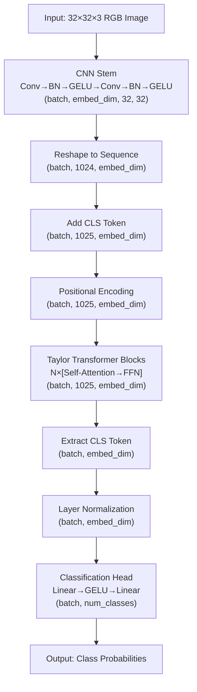

# TaylorIR

A transformer-based image classifier that uses Taylor series approximation instead of softmax for more efficient attention calculation.

```css
Input: 32x32x3 RGB Image
    ↓
[CNN STEM]
    Convolutional preprocessing
    Conv → BN → GELU → Conv → BN → GELU
    (batch_size, 3, 32, 32) → (batch_size, embed_dim, 32, 32)
    ↓
[RESHAPING]
    Permute and reshape for sequence processing
    (batch_size, embed_dim, 32, 32) → (batch_size, 1024, embed_dim)
    ↓
[CLS TOKEN ADDITION]
    Prepend learnable classification token
    (batch_size, 1024, embed_dim) → (batch_size, 1025, embed_dim)
    ↓
[POSITIONAL ENCODING]
    Add sinusoidal position embeddings
    Maintains (batch_size, 1025, embed_dim)
    ↓
[TAYLOR TRANSFORMER BLOCKS - N LAYERS]
    For each layer:
        ┌─────────────────────────────────┐
        │ Layer Normalization 1           │
        │   ↓                             │
        │ Taylor Window Attention         │
        │   QK^T → Taylor Approximation   │
        │   ↓                             │
        │ Residual connection             │
        │   ↓                             │
        │ Layer Normalization 2           │
        │   ↓                             │
        │ Feed-Forward Network            │
        │   (embed_dim → 4*embed_dim → embed_dim) │
        │   ↓                             │
        │ Residual connection             │
        └─────────────────────────────────┘
    Maintains (batch_size, 1025, embed_dim) throughout
    ↓
[FEATURE EXTRACTION]
    Extract CLS token embedding
    (batch_size, 1025, embed_dim) → (batch_size, embed_dim)
    ↓
    Layer Normalization
    Maintains (batch_size, embed_dim)
    ↓
[CLASSIFICATION HEAD]
    Linear → GELU → Dropout
    (batch_size, embed_dim) → (batch_size, dim_feedforward)
    ↓
    Linear
    (batch_size, dim_feedforward) → (batch_size, num_classes)
    ↓
Output: Class Probabilities
```



## Key Features

### Taylor Window Attention

TaylorIR uses a Taylor series approximation for the attention mechanism:

```math
Attention(Q, K, V) = \text{TaylorSoftmax}(QK^T)V
```

Where TaylorSoftmax is defined as:

```math
\text{TaylorSoftmax}(A) = \frac{1 + A + 0.5A^2}{\sum_{j=1}^{n}(1 + A_j + 0.5A_j^2)}
```

This approximation:
- Requires fewer FLOPs than standard softmax
- Maintains comparable accuracy to standard attention
- Reduces computational complexity for low to moderate attention scores

### Architecture

- **CNN Stem**: Initial feature extraction with convolutional layers
- **Sequence Transformation**: Flatten spatial dimensions to create token sequence
- **CLS Token**: Added for classification, similar to BERT and ViT
- **Taylor Transformer Blocks**: Multiple layers of Taylor-approximated self-attention and feed-forward networks
- **Classification Head**: Projects final CLS token to class probabilities

### Efficiency Improvements

- Gradient checkpointing option for reduced memory usage
- Pre-norm architecture for better training stability
- Taylor approximation reduces computational burden

## Performance

TaylorIR offers a good balance between:
- Computational efficiency (faster than standard transformers)
- Parameter efficiency (comparable to efficient CNN architectures)
- Accuracy (competitive with standard transformers)

## Model Configurations

- **Small**: 128 dimensions, 4 heads, 4 layers
- **Base**: 192 dimensions, 6 heads, 6 layers
- **Large**: 256 dimensions, 8 heads, 8 layers
